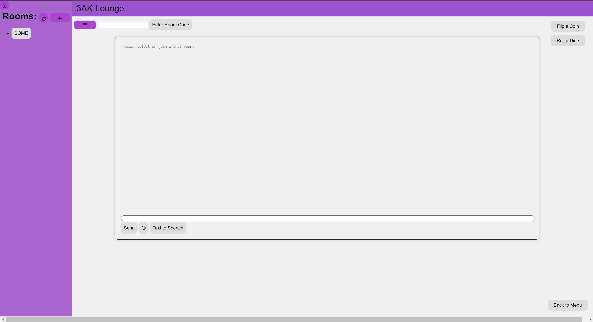

# Final Assignment - Improved Web Chat Server
> Course: CSCI 2020U: Software Systems Development and Integration

Arad Ayntabli - 100845722 
Alan Zheng - 100868898 
Karankumar Patel - 100869607 
Ashton Skinner-Dooley - 100870405

## Overview
We have created a web chat room where you can talk with your friends via text.

## Improvements

We decided to add a "Send" button, that sends the message. The user can still use enter to send the message.  
We added buttons to the navigation tab, you can click on these buttons to join rooms instead of entering the code  
We added Emojis. The user can add the emojis by typing the emojis name between colons (:smile:) or they can choose them from a dropdown menu.  
We added to chance games, where the users can roll a die or flip a coin. This could be used to settle arguments or make decisions.  
We added the ability to speak into your microphone and whatever you said will be put into the text box for you to input.  
We added a Login page.  
We wanted to add a button in a room that "locks" or "unlocks" the room, not allowing anyone else to join the room. The users who are in that room will also not be able to join back after leaving when locked. We chose not to add it in the end.

## How to Run
Make sure you have the correct configurations
>1. Your URL for your local Glassfish server should be http://localhost:8080/WSChatServer-1.0-SNAPSHOT/
>2. Set your domain to domain1
>3. Add the war exploded artifact

Next, run your server and wait for your browser to pop up. 
Now you will see our menu, click enter, and you'll be redirected to a login screen. 
Enter your desired Username and click login. 
Depending on your display you might have to zoom out until it looks like the attached screenshot 

Now you should be able to open the rooms tab and create or join a room

## Demo Videos

## External Sources
We used a java Library called emoji-java, the link to their github is <a href="https://github.com/vdurmont/emoji-java" > here</a>

Invention Tricks. (2021, December 13). Voice to text converter using JavaScript | speech to text converter. YouTube. https;//www.youtube.com/watch?v=SFGIKucaOZA&ab_channel=InventionTricks

## Contribution Report

<table> 
<thead>
<td>Name</td><td>%</td><td>Task</td>
</thead>
<tbody>
<tr><td>Arad Ayntabli</td><td>25%</td><td>Code</td></tr>
<tr><td>Alan Zheng</td><td>25%</td><td>Code</td></tr>
<tr><td>Ashton Skinner-Dooley</td><td>25%</td><td>UI</td></tr>
<tr><td>Karankumar Patil</td><td>25%</td><td>Code</td></tr>
</tbody>
</table>